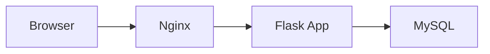
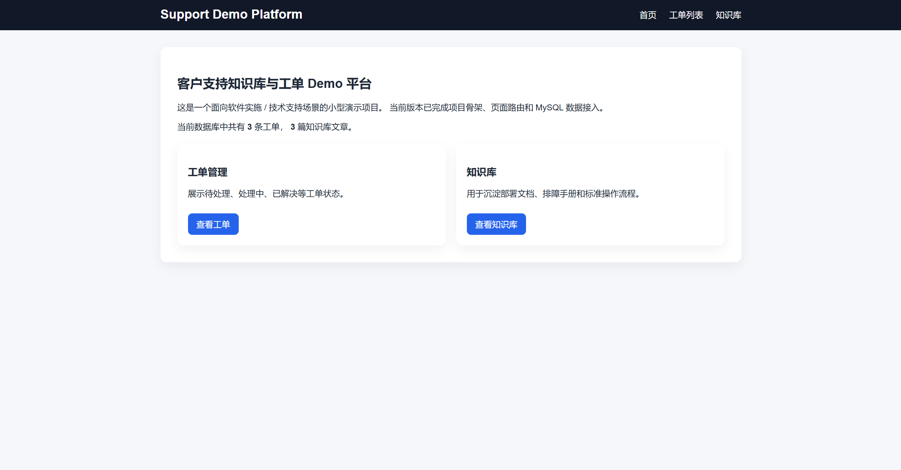
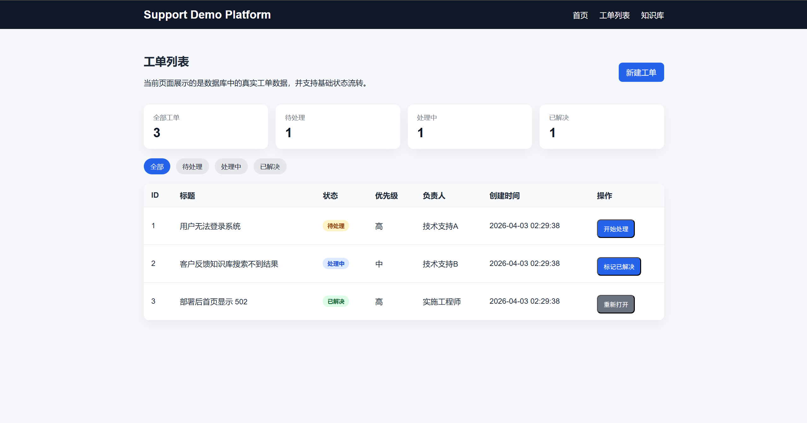
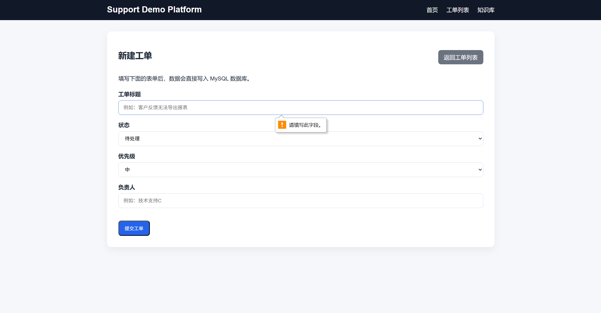
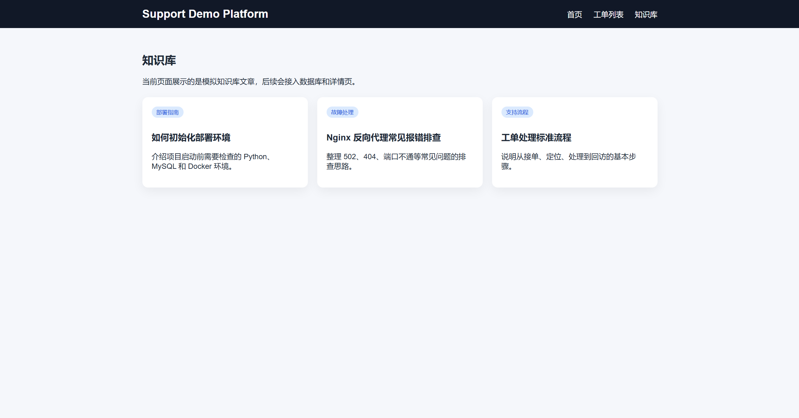

# Support Demo Platform

一个面向 **技术支持 / 软件实施 / 售前技术支持** 场景的小型演示项目。

本项目模拟了一个内部客户支持 Demo 环境，提供基础的工单管理与知识库展示能力，并使用 **Flask + MySQL + Docker Compose + Nginx** 完成应用开发、数据库接入、容器化部署与反向代理配置。

## 项目定位

这个项目不是为了展示复杂业务开发能力，而是为了展示：

- 基础 Web 系统搭建能力
- MySQL 数据接入能力
- Docker Compose 多容器部署能力
- Nginx 反向代理配置能力
- 基础工单流转逻辑实现能力
- 面向交付 / 演示 / 排障场景的项目组织能力

## 当前已实现功能

- 首页统计展示
- 工单列表展示
- 工单新建表单
- 工单状态流转
  - 待处理 -> 处理中
  - 处理中 -> 已解决
  - 已解决 -> 重新打开为处理中
- 工单状态筛选
- 知识库文章展示
- MySQL 数据持久化
- Docker Compose 一键启动
- Nginx 反向代理访问入口

## 技术栈

- Python
- Flask
- Flask-SQLAlchemy
- MySQL 8.0
- Docker
- Docker Compose
- Nginx
- HTML / CSS

## 项目结构

```text
support-demo-platform/
├─ app/
│  ├─ static/
│  ├─ templates/
│  ├─ __init__.py
│  ├─ extensions.py
│  ├─ models.py
│  └─ routes.py
├─ docs/
│  ├─ images/
│  ├─ deployment.md
│  ├─ troubleshooting.md
│  └─ postmortem-502.md
├─ .dockerignore
├─ .env.example
├─ .gitignore
├─ Dockerfile
├─ docker-compose.yml
├─ entrypoint.sh
├─ init_db.py
├─ requirements.txt
└─ run.py
```

## 系统架构



访问链路可以概括为：

**浏览器 -> Nginx -> Flask -> MySQL**

## 快速启动

### 1. 克隆仓库

```bash
git clone https://github.com/Cymaticstride/support-demo-platform.git
cd support-demo-platform
```

### 2. 启动服务

```bash
docker compose up -d --build
```

### 3. 访问项目

浏览器打开：

```text
http://127.0.0.1:8080
```

### 4. 查看服务状态

```bash
docker compose ps
```

### 5. 查看日志

```bash
docker compose logs -f nginx
docker compose logs -f web
docker compose logs -f db
```

## 数据库连接信息

如果需要使用 DBeaver 连接本地数据库，可使用：

- Host: `127.0.0.1`
- Port: `3307`
- User: `root`
- Password: `123456`
- Database: `support_demo`

## 页面截图

### 首页



### 工单列表页



### 新建工单页



### 知识库页



## 相关文档

- [部署说明](docs/deployment.md)
- [常见排障手册](docs/troubleshooting.md)
- [502 故障复盘示例](docs/postmortem-502.md)

## 项目说明

这个项目更偏向“交付演示系统”而不是“复杂业务系统”。  
它的目标岗位主要是：

- 技术支持
- 软件实施
- 售前技术支持
- 初级运维（辅助方向）

因此，本项目重点放在：

- 环境搭建
- 数据初始化
- 容器化部署
- Nginx 代理
- 页面演示
- 工单基础流转
- 故障排查与文档输出

而不是复杂权限体系、微服务拆分或高并发设计。

## 后续可扩展方向

- 工单编辑与删除
- 知识库详情页
- 登录鉴权
- Shell 自动化部署脚本
- 巡检脚本
- 备份恢复脚本
- 故障演练 SOP

## 说明

本项目用于学习与求职展示。
